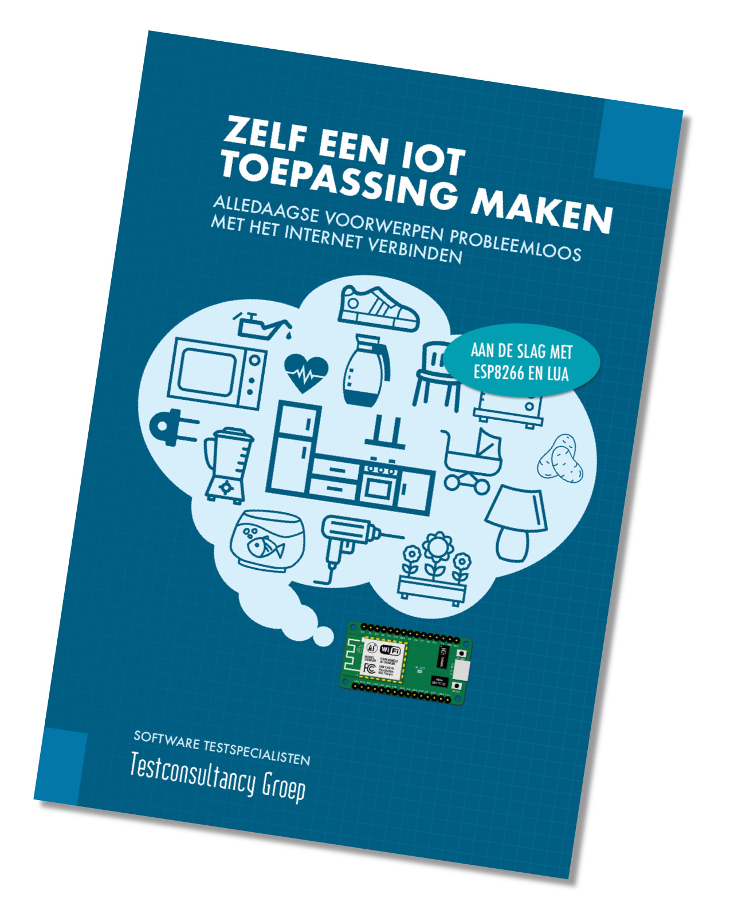

# Zelf een IoT toepassing maken 
_Programma's en codevoorbeelden uit het boek_  

De NodeMCU is een kleine computer met allerlei in- en uitgangen die eenvoudig met het internet is te verbinden. Je kunt een NodeMCU herkennen aan de micro-USB aansluiting aan de ene kant en een wifi-antenne op de andere kant. Het printplaatje heeft afmetingen van ongeveer 5 x 2,5 cm. Je programmeert de NodeMCU met instructies in de taal Lua, wat 'maan' betekent in het Portugees.

## Wat heb je nodig
* Een NodeMCU
* Een micro-USB kabeltje
* Een Windows- of OS X computer (Linux kan ook, maar het gebruik daarvan beschrijven we hier niet)
* Beschikking over een wifi toegangspunt

Verder is een breadboard met minimaal 400 gaatjes handig en draadjes waarmee je gemakkelijk op het breadboard verbindingen kunt maken. Op je Windows- of OS X computer moet een USB-driver voor de NodeMCU worden geïnstalleerd. Ook moet de ESPlorer programmeeromgeving worden gedownload. Om deze te kunnen gebruiken is Java nodig, die meestal al wel op de computer staat. Alle genoemde software is gratis. Onderaan deze pagina vind je links naar software die je kunt downloaden.

**Alle genoemde onderdelen en het boek Zelf een IoT toepassing maken, zijn online en in de winkel verkrijgbaar bij [Okaphone](https://www.okaphone.com/search.asp?advanced=0&query=nodemcu). Ook voor een keur aan sensoren en tips en adviezen kun je daar terecht.**

### Beschrijving van het blokschema van de NodeMCU
Een NodeMCU heeft vier belangrijke onderdelen: een spanningsregulator naar 3,3 volt, een USB naar serieel conversiechip, een microcontroller van het type ESP8266 en een 4 MB groot flashgeheugen voor de Lua interpreter, de firmware en jouw eigen programma's. Het geheugen is groot genoeg voor tientallen programma's, die elkaar kunnen aanroepen met <code>resultaat = dofile("luaprogramma")</code>.

In het midden van het blokschema is de microcontroller getekend. Dit is een klein chipje van 5 x 5 mm dat samen met het flashgeheugen onder het metalen dekseltje op de NodeMCU zit. In het chipje zit wifi, een moderne microprocessor, de aansluitingen voor sensoren en actuatoren, een 'Real Time Clock' en de communicatiepoort die met de USB omzetter is verbonden.

Het flashgeheugen bevat in elk geval een bootloader en de NodeMCU firmware. Met de bootloader is het mogelijk om nieuwe, verbeterde NodeMCU firmware te laden. Ook zit er in het flashgeheugen een 'SPIFFS': een bestandssysteem dat ervoor zorgt dat je je programma's kunt opslaan, maar ook dat je vanuit je programma's eenvoudig gegevens kunt bewaren.

### Downloaden van de juiste driver voor de NodeMCU
NodeMCU's hebben een kleine USB conversiechip. Het merk en type hiervan bepaalt, welke USB driver je nodig hebt voor je NodeMCU. De benodigde USB drivers kun je van de website van de fabrikant van de USB conversiechip downloaden. De NodeMCU's van _Amica_ en _LoLin_ maken gebruik van de [Silicon Labs CP210](https://www.silabs.com/products/development-tools/software/usb-to-uart-bridge-vcp-drivers). De NodeMCU's van _GeekCreit DOIT_ maken gebruik van de [WCH CH340](http://www.wch.cn/download/CH341SER_EXE.html). Het merk van de NodeMCU staat op de achterkant.

### Downloaden van de programmeeromgeving
De gebruikte programmeeromgeving die wordt gebruikt voor de NodeMCU heet _ESPlorer_. Deze programmeeromgeving kun je [van de website van de auteur downloaden](https://esp8266.ru/esplorer-latest/?f=ESPlorer.zip). De download komt als `.zip` bestand, die uitgepakt een enkele `esplorer.jar` bevat. Het kan nodig zijn om Java op je computer te installeren. Met [deze link](https://www.java.com/en/download/installed.jsp) kun je controleren of je de juiste Java versie geïnstalleerd hebt.

## Aan de slag
Je NodeMCU wordt op een stukje schuim geleverd. Het schuim zorgt ervoor dat de aansluitpennen van de NodeMCU niet buigen en niet per ongeluk kortsluiting maken. Als je iets op je NodeMCU wilt aansluiten dan is het nodig een breadboard te gebruiken. Hieronder zie je een NodeMCU die op een breadboard is gedrukt. Je ziet dat er boven en onder de NodeMCU een gaatjesrij is vrijgehouden. Hier kun je een draadje inprikken om verbindingen te maken met bijvoorbeeld een sensor.

Met een micro-USB kabeltje voorzie je de NodeMCU (en alles wat er op is aangesloten) van stroom. Ook kun je zo de NodeMCU programmeren. In de volgende paragraaf wordt uitgelegd hoe je met de programmeeromgeving werkt.

### Werken met de programmeeromgeving
1. **Verbindingsinstellingen**: hier kies je de USB poort waarop je NodeMCU is aangesloten. De verbindingssnelheid moet op 115200 zijn ingesteld. Klik op de grote knop om met je NodeMCU te verbinden.
2. **Terminalvenster**: hier wordt de uitvoer van de NodeMCU getoond.
3. **Bestandsbeheer**: met deze knoppen kun je de bestanden op je NodeMCU beheren. Met Refresh ververs je de lijst.
4. **Programmabeheer**: met deze knoppen maak je een nieuw programma aan, bewaar je het programma dat je aan het schrijven bent en open je programma's die je op je computer hebt opgeslagen.
5. **Editor**: dit is het venster waarin je je programma's kunt maken en aanpassen.
6. **Directe instructies**: hier kun je een enkele instructie naar de NodeMCU sturen, die direct wordt uitgevoerd.

Nadat je de NodeMCU op je computer hebt aangesloten en de programmeeromgeving hebt geopend, kies je de juiste USB poort en stel je de verbindingssnelheid in op 115.200 bits per seconde. Je kunt nu de verbinding openen met de grote knop waar de tekst Open op staat. Als je niet direct iets in het terminalvenster ziet verschijnen dan kun je op de Reset knop van je NodeMCU drukken. In het terminalvenster verschijnt de tekst die de NodeMCU verstuurt.

### Je eerste programma op de NodeMCU
Met het programma <code>blink.lua</code> laat je een ingebouwde led op de NodeMCU knipperen. Je controleert met dit programma of je alles goed op je computer hebt geïnstalleerd en ziet gelijk je NodeMCU werken.

Je maakt op de hierboven beschreven wijze verbinding met de NodeMCU en kopieert de code van <code>blink.lua</code> in het programmavenster. Sla het programma op door op het icoon van de diskette te klikken. Er wordt om de naam van het programma gevraagt: voer hier _blink.lua_ in. Na het opslaan wordt het programma naar de NodeMCU verzonden; je ziet de voortgang hiervan in het terminalvenster. Na enkele seconden zie je hoe de led van je NodeMCU gaat knipperen.

### Je NodeMCU met het internet verbinden
Een NodeMCU onthoudt automatisch het laatstgebruikte wifi toegangspunt. Dat betekent dat als je eenmaal je NodeMCU hebt ingesteld om gebruik te maken van een bepaald wifi toegangspunt, de NodeMCU die verbinding dan steeds opnieuw zelf maakt. Om de wifi instellingen goed te zetten kun je gebruik maken van het <code>wifi.lua</code> script. Je moet in dit script de gegevens van je eigen wifi toegangspunt zetten. Als je het script uitvoert dan zie je op het scherm van je computer of de verbinding is gemaakt.  

### Een sensor aansluiten op je NodeMCU
Je kunt op verschillende manieren sensoren inlezen met je NodeMCU:
* Analoge waarden, zoals die van een LDR of vochtsensor aangesloten op <code>A0</code>, inlezen met <code>sensorwaarde = adc.read(0)</code>
* Aan-uit schakelaars inlezen met <code>sensorwaarde = gpio.read(poortnummer)</code>. Poortnummer kan hier 0 tot 8 zijn, voor sensoren die zijn aangesloten op <code>D0</code>..<code>D8</code>
* Speciale sensoren, zoals de DS18B20 temperatuursensor en de DHT22 vochtsensor, hebben eigen manieren om te verbinden met de NodeMCU. In Lua zijn hiervoor speciale instructies opgenomen.

## Inleiding in Lua

### Variabelen en typeringen  
    variabele = waarde  
    local a = 10  
    b = true  
    c = false  
    d = nil  
    e, f, g = 5, "hallo", 6.1  

### Operatoren
    or
    and
    <  >  <=  >=  ~=  ==  ..
    +  -
    *  /  %
    not   #   -
    ^

### Voorwaardelijke lussen
    while i <= 5 do
    end
    
    repeat
      break
    until i > 10
    
    for i = 1, 10, 2 do
    end

### Functies
    function doedit()
      local x, y = doedat(4, 5)
      return x^y
    end
    
    function doedat(a1, a2)
      return a1*2, a2*3
    end

### Tabellen
    x = 5
    a = {}
    b = {sl1 = x, sl2 = 3}
    
    a[1] = 20
    
    print(a[1])

### Strings
    s = "Hallo wereld"
    print(#s) -- 15
    
    t = "123" .. 4 .. "56"
    
### Getallen en berekeningen
    a = 3.1415926
    b = a * 2
    
    c = node.random() -- 0..1
    d = node.random(10) -- 1..10

### Bestanden
    file.open("waarden.txt")
    file.write(1)
    file.write(2)
    file.writeln(3)
    file.close
    file.open("anderewaarden")
    a = {}
    a = file.readline()
    file.close()

### Input en output
    gpio.mode(1, gpio.INPUT, gpio.PULLUP)
    if gpio.read(1) then
      print("hoog signaal")
    else
      print("laag signaal")
    end
    print(adc.read(0))

### Timers en gebeurtenissen
    tmr.delay(1000)
    start = tmr.now()
    
    tmr.alarm(0, 1000,
      tmr.ALARM_AUTO,
      function()
        print("hallo")
      end)

## Gebruik maken van de kracht van het internet
Je NodeMCU kan heel eenvoudig een webpagina opvragen met de instructie <code>http.get("http://adres-van-de-webpagina")</code>. Sommige webpagina's voeren taken voor je uit, voordat ze de pagina tonen. Ze kunnen bijvoorbeeld een twitterbericht voor je versturen, of namens jou een email verzenden. 

### If This Then That
Zo'n taak-uitvoerende-website is het gratis <a href="http://www.ifttt.com">IFTTT.com</a>, wat voor _IF_ _This_ _Then_ _That_ staat ("als dit, dan dat"). Je kunt met IFTTT instellen dat als je er een speciale pagina (je noemt dat een _websocket_) opvraagt, IFTTT voor jou een activiteit uitvoert. Je maakt, zoals IFTTT het noemt, een _applet_. Het adres van die speciale pagina kopieer je in je NodeMCU. Nu kan je NodeMCU op ieder moment die applet aanroepen, bijvoorbeeld als er een nieuwe sensorwaarde beschikbaar is. Je kunt die sensorwaarde zelfs meegeven bij het aanroepen van de speciale pagina. Zo kun je bijvoorbeeld een Google spreadsheet met sensorwaarden laten vullen, of IFTTT een slimme thermostaat laten aansturen.

### ThingSpeak
Een andere gratis taak-uitvoerende-website is <a href="http://www.thingspeak.com">ThingSpeak.com</a>. ThingSpeak bewaart sensorgegevens voor je en maakt er mooie grafieken van. Je kunt nieuwe sensorwaarden ook weer met de <code>http.get</code> instructie verzenden, waarbij de verschillende sensorwaarden in de URL worden meegegeven.

## Projecten om mee van start te gaan

### Grondvochtigheidsmeting
Het meten van de vochtigheid van grond is een interessante IoT toepassing, bijvoorbeeld om gesignaleerd te worden als een kamerplant moet worden bewaterd. Je gebruikt hiervoor een [bodemsensor](https://www.okaphone.com/artikel.asp?id=484444), die bestaat uit twee elektrodes waartussen de weerstand wordt gemeten. De weerstand van grond is evenredig met de vochtigheid ervan: hoe vochtiger de grond, hoe lager de weerstand. Op de grondsensor is een transistor opgenomen die de gemeten weerstand omzet in een spanning. De spanning is laag als er weinig vocht in de grond zit en hoog als er veel vocht in de grond zit.

Je doet een vochtmeting met `meetwaarde = adc.read(0)`. Met het voorbeeldprogramma [testanalog.lua](testanalog.lua) laat je de vochtmeting iedere 2 seconden op het scherm zien. Als je wilt, kunt je de gemeten waarde op het internet publiceren, bijvoorbeeld door het met een webhook naar ThingSpeak te versturen. Je kunt daar het voorbeeldprogramma [resistancetothingspeak.lua](resistancetothingspeak.lua) voor gebruiken. De gemeten weerstand wordt dan iedere 5 seconden naar ThingSpeak gestuurd.

### Beweging melden
Beweging kun je detecteren met een [Passief Infra Rood (PIR) sensor](https://www.okaphone.com/artikel.asp?id=484591). Deze heeft een schakeluitgang die sluit als er beweging wordt gedetecteerd. Je kunt instellen hoe gevoelig de sensor moet zijn en hoe lang de schakeluitgang na de gedetecteerde beweging nog gesloten moet blijven. Het continue uitlezen van de status van de PIR sensor noemen we ook wel _[polling](voorbeeld-io-polling.lua)_, wat niet zo'n efficiente manier is om schakelaars en andere schakelende sensoren uit te lezen. Beter is, om gebruik te maken van _[events](voorbeeld-io-event.lua)_. 

Met het voorbeeldprogramma [testpir.lua](testpir.lua) controleer je of je de PIR sensor goed hebt aangesloten. En als je wilt kun je met IFTTT een actie, zoals een Tweet of email versturen, laten uitvoeren zodra er beweging wordt gedetecteerd. Je gebruikt daarvoor [pirtoifttt.lua](pirtoifttt.lua).

## Problemen oplossen
Werken met microcontrollers zoals de NodeMCU is heel plezierig en meestal krijg je snel resultaten. Soms zit er echter wat tegen. Hieronder volgt een lijstje aandachtspunten voor als het allemaal niet werkt zoals je dat wilt:
* Je ziet niet de USB poort in de programmeeromgeving verschijnen  
Controleer of je NodeMCU is aangesloten. Druk op de Refresh knop gelijk rechts naast de lijst met USB poorten. Staat je USB poort er niet tussen? Dan moet je waarschijnlijk de USB driver nog installeren
* Kan geen verbinding maken met de NodeMCU  
Controleer dat je de micro-USB kabel hebt aangesloten, de juiste USB poort hebt gekozen, 115200 als verbindingssnelheid heb gekozen en op de Open knop hebt gedrukt. Als je niet nog steeds niets in het terminalscherm ziet, druk dan op de Reset-knop van de NodeMCU
* Je NodeMCU lijkt niet te willen werken met drijvende-komma-getallen, of enkele Lua instructies die hier genoemd worden lijken niet op je NodeMCU te werken  
Het kan nodig zijn om nieuwe, verbeterde NodeMCU firmware op je NodeMCU te zetten. Volg hiervoor het update firmware stappenplan.  

## Links en downloads
**Alle genoemde onderdelen en het boek Zelf een IoT toepassing maken, zijn online en in de winkel verkrijgbaar bij [Okaphone](https://www.okaphone.com/search.asp?advanced=0&query=nodemcu). Ook voor een keur aan sensoren en tips en adviezen kun je daar terecht.**  

* [wifi.lua](wifi.lua)
Met dit Lua programma worden de instellingen voor wifi verbindingen met het internet ingesteld. Wifi instellingen worden lokaal op de NodeMCU bewaard en daarom is het niet nodig om vaker dan 1 keer de wifi verbinding in te stellen. 
* [blink.lua](blink.lua)
Dit Lua programma laat de led D0 op de NodeMCU met tussenpozen van 1 seconde knipperen.
* [testpir.lua](testpir.lua)
Met dit Lua programma is eenvoudig te testen of een PIR sensor op de juiste manier op de NodeMCU is aangesloten.
* [pirtoifttt.lua](pirtoifttt.lua)
Dit Lua programma maakt verbinding met het internet en roept via een webhook een applet op IFTTT aan. Deze applet kan vervolgens een actie naar wens uitvoeren, zoals het versturen van een Twitter bericht.
* [testanalog.lua](testanalog.lua)
Hiermee wordt de (enige) analoge poort van de NodeMCU uitgelezen en wordt de waarde op het scherm getoond.
* [resistancetothingspeak.lua](resistancetothingspeak.lua)
Dit Lua programma maakt verbinding met het internet en stuurt via een webhook de gemeten waarde van de analoge poort naar ThingSpeak.
